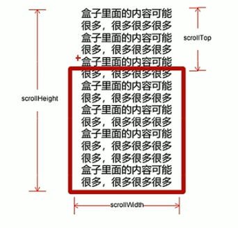


这篇文章仍处在更新当中。


# JS基础
## 类型
- 基础数据类型
  **最新的 ECMAScript 标准定义了 8 种数据类型,分别是**
  - `string`
  - `number`
  - `bigint`
  - `boolean`
  - `null` (<code>typeof null</code>返回结果为object)
  - `undefined`
  - `symbol` (ECMAScript 2016新增)
> 所有基本类型的值都是不可改变的。但需要注意的是，基本类型本身和一个赋值为基本类型的变量的区别。变量会被赋予一个新值，而原值不能像数组、对象以及函数那样被改变。
- 引用类型
  - `Object`（包含普通对象-Object，数组对象-Array，正则对象-RegExp，日期对象-Date，数学函数-Math，函数对象-Function）

基本数据类型会放在<b>栈</b>上，引用类型放在<b>堆</b>上
<!-- more -->
## 函数的参数传递
- 基本数据类型的参数传递
<div>
<div class='center'>
``` javascript
function fn(a) {
    a++;
    console.log(a);
}
var x = 10;
fn(x)
console.log(x);
```
可以看到传入函数<code>fn</code>的，是变量x的一个复制（值拷贝）。因此尽管函数体内部该变量发生变化，原变量x不发生改变。
</div>
<div class='clear'></div>
</div>

- 引用类型的参数传递
<div>
<div class='center'>
``` javascript

function fn(a) {
    a[0] = 'a';
    console.log(a);
}
var x = new Array(1, 2, 3);
fn(x)
console.log(x);
```
这里传入函数的变量a是引用类型（数组对象），实际上传入参数指向了堆中相同的地址，此时函数体内部改变了堆上对象的属性，在函数外也发生改变。
</div>
<div class='clear'></div>
</div>

## 变量的作用域
### 局部和全局变量
<div>
<div class='center'>
``` javascript
    var p = 0;
    function fn() {
        var p = 1;
        p = 2;
        console.log('局部作用域的局部变量p:' + p);
        //局部作用域的全局变量
        num = 100;
    }
    console.log('全局作用域的全局变量p:' + p);
    fn();
    console.log('未声明在函数内部赋值的变量属于全局变量:' + num)
```

</div>
<div class='clear'></div>
</div>

- 局部变量只在函数内部生效  
- 当局部变量与全局变量重名时，对变量的修改只对局部变量生效  
- 未声明在函数内部赋值的变量属于全局变量（即函数外可调用）
- 函数的形参也是局部变量

### 作用域链
<div>
<div class='center'>
``` javascript
var num = 1;
function fn() {
    var num = 2;
    fn2();
    function fn2() {
        console.log(num);
    }
}
fn();
```
</div>
<div class='clear'></div>
</div>
&emsp;&emsp;·内部函数访问外部变量，根据链式查找方式决定。

## JS的预解析
<div>
<div class='center'>
``` javascript
// 1.先向控制台打印变量，后声明该变量并赋值
console.log(num);
var num = 10;
// 控制台输出undefined

// 2.先调用函数，后通过函数声明的方式创建函数
fn();
function fn() {
    console.log('fn');
}
// 控制台输出'fn'

// 3.以函数表达式创建函数（匿名函数）
fn2();
var fn2() = function() {
    console.log('fn2')
}
// 控制台报错 Uncaught TypeError: fn2 is not a function
```
</div>
<div class='clear'></div>
</div>

&emsp;&emsp;JS解释器在执行js脚本时，会先进行预解析，然后进行代码执行。  
&emsp;&emsp;&emsp;&emsp;(1)预解析将所有**var声明**的变量以及function提升至当前作用域的最前面。  
&emsp;&emsp;&emsp;&emsp;(2)按照预解析后的顺序依次执行。  
&emsp;&emsp;预解析分为变量预解析和函数预解析。
&emsp;&emsp;&emsp;&emsp;(1)变量预解析将变量的声明放在最前方。**不涉及变量赋值**  
&emsp;&emsp;&emsp;&emsp;(2)函数预解析将函数声明所创建的函数放在最前方。**不涉及函数表达式创建的函数**  

&emsp;&emsp;因此，上面的代码实际执行顺序如下：  
<div>
<div class='center'>
``` javascript
var num;
var fn2();
function fn() {
    console.log('fn');
}
// 此时num未赋值，因此输出undefined
console.log(num);
num = 10;
// fn()已经声明，可以正常调用
fn();
// fn2 只是一个变量，还不是函数，因此fn2()语句会出错。
fn2();
fn2 = function() {
    console.log('fn2')
}
```
</div>
<div class='clear'></div>
</div>

# DOM：文档对象模型
## 基础概念
- 文档
    - 一个页面就是一个文档，DOM中用document表示
- 元素
    - 页面中所有标签都是元素，DOM中用element表示
- 节点
    - 网页中的所有内容都是节点（标签 属性 文本 注释等），DOM中用node表示  

**DOM把以上内容都看做是对象**


## 获取元素
- <code>document.***getElementById***</code>
    - 参数:id字符串
    - 返回文档中拥有特定ID的元素，不存在则返回Null
    - 返回值为*一个* **Element** 对象
- <code>document.***getElementsByTagName***</code>
    - 参数:标签类名字符串
    - 返回某类标签 **集合** ，以伪数组形式存储，不存在则返回空的伪数组
    - 指定父元素：***element***.getElementsByTagName('Tag name')
- <code>document.***getElementsByClassName***</code>
    - 根据类名返回元素对象 **集合**
- <code>document.***querySelector***</code>
    - 根据指定选择器返回**第一个**元素对象
    - 选择器需要加符号 . #
- <code>document.***querySelectorAll***</code>
    - 根据指定选择器返回所有元素对象集合
    - 选择器需要加符号 . #
- <code>document.***body***</code>
    - 获取body元素
- <code>document.***documentElement***</code>
    - 获取html元素

## 事件基础
&emsp;&emsp;事件：可以被JavaScript侦测到的行为。
- 事件三要素
    - 事件源 事件被触发的对象
    - 事件类型 如何触发（什么事件）
    - 事件处理程序

<button id='event_btn'>测试按钮</button>
<script>
    var btn = document.getElementById('event_btn');
    btn.onclick = function(){
        alert("在此示例中：\n    按钮是事件源。\n    onclick是事件类型。\n    弹出当前窗口用到的alert函数就是事件处理程序。");
    }
</script>

&emsp;&emsp;**常见鼠标事件**
<div class='center'>

| 鼠标事件                 | 触发条件     |
| ------------------------ | ------------ |
| <code>onclick</code>     | 点击左键     |
| <code>onmouseover</code> | 鼠标经过     |
| <code>onmouseout</code>  | 鼠标离开     |
| <code>onfocus</code>     | 获得鼠标焦点 |
| <code>onblur</code>      | 失去鼠标焦点 |
| <code>onmousemove</code> | 鼠标移动     |
| <code>onmouseup</code>   | 鼠标弹起     |
| <code>onmousedown</code> | 鼠标按下     |

</div>
<div class='clear'></div>

## 事件高级
- 绑定 / 注册事件
    - 以上给元素添加事件的方式（利用on开头的事件）是**传统方式**注册事件
        - 特点：唯一性，同一个元素的同一事件只能设置一个处理函数，后注册的处理函数会覆盖前面注册的
    - W3C标准推荐使用方法监听注册方式
        - addEventListener()是一个方法
        - IE9以前不支持此方法，可使用attachEvent()方法代替
        - 特点：同一个元素同一事件可以注册多个监听器
    - <code>eventTarget.***addEventListener(type, listener, [useCapture])***</code>
        - type: 事件类型字符串
        - listener: 事件处理函数
        - useCapture: 可选参数，默认为false
- 解绑事件
    - 传统方式绑定的事件解绑: on事件 = null;
    - 方法监听绑定的事件解绑: removeEventListener()
    - <code>eventTarget.***removeEventListener(type, listener, [useCapture])***</code>
        - type: 事件类型字符串
        - listener: 事件处理函数
        - useCapture: 可选参数，默认为false

### DOM事件流理论
&emsp;&emsp;DOM中事件流描述的是从页面中接收事件的顺序。事件发生时会在元素节点之间按照特定的顺序传播，这个传播过程即DOM事件流。
- DOM事件流分为3个阶段
    - 捕获阶段：从上至下
    - 当前目标阶段
    - 冒泡阶段：从下至上
        - 实际开发中很少使用事件捕获，更关注事件冒泡
        - onblur onfocus onmouseenter onmouseleave 事件等没有冒泡
**例子：**

<!-- tab HTML -->
``` HTML
<div id='event'>
    <div id='father1'>
        <div id = 'son1'>冒泡</div>
    </div>
    <span></span>
    <div id='father2'>
        <div id = 'son2'>捕获</div>
    </div>
</div>
```
<!-- endtab -->
<!-- tab CSS -->
``` CSS
    #event {
        margin: 0 auto;
        width: 50%;
        border: 1px dotted #666;
        text-align: center;
    }
    #event>span {
        display: inline-block;
        width: 10%;
    }

    #father1, #father2 {
        display: inline-block;
        width: 100px;
        height: 100px;
        background-color: skyblue;
    }

    #son1, #son2 {
        cursor: pointer;
        margin: 25% auto;
        width: 50%;
        height: 50%;
        background-color: pink;
    }
```
<!-- endtab -->
<!-- tab Javascript -->
``` Javascript
    var f1 = document.querySelector('#father1');
    var s1 = document.querySelector('#son1');
    var f2 = document.querySelector('#father2');
    var s2 = document.querySelector('#son2');
    f1.addEventListener('click', myName);
    s1.addEventListener('click', myName);
    f2.addEventListener('click', myName, true);
    s2.addEventListener('click', myName, true);

    function myName(e){
        alert('我是' + this.id);
        console.log(e.target,this);
    }
```
<!-- endtab -->


<style>
    #event {
        margin: 0 auto;
        width: 50%;
        border: 1px dotted #666;
        text-align: center;
    }
    #event>span {
        display: inline-block;
        width: 10%;
    }

    #father1, #father2 {
        display: inline-block;
        width: 100px;
        height: 100px;
        background-color: skyblue;
    }

    #son1, #son2 {
        cursor: pointer;
        margin: 25% auto;
        width: 50%;
        height: 50%;
        background-color: pink;
    }
</style>
**效果：**
<div id='event'>
    <div id='father1'>
        <div id = 'son1'>冒泡</div>
    </div><span></span>
    <div id='father2'>
        <div id = 'son2'>捕获</div>
    </div>
</div>

<script>
    var f1 = document.querySelector('#father1');
    var s1 = document.querySelector('#son1');
    var f2 = document.querySelector('#father2');
    var s2 = document.querySelector('#son2');
    f1.addEventListener('click', myName);
    s1.addEventListener('click', myName);
    f2.addEventListener('click', myName, true);
    s2.addEventListener('click', myName, true);

    function myName(e){
        alert('我是' + this.id);
        console.log(e.target,this)
    }
</script>

### 事件对象
- 监听函数的形参
- 事件对象只有存在事件才会存在，系统自动创建
- 事件对象中包含了与事件相关的数据 属性 方法等
    - <code>e.***target***</code>: 返回触发事件的对象
        - this: 返回绑定的对象，注意区别
    - <code>e.***type***</code>: 事件类型
    - <code>e.***preventDefault()***</code> 阻止默认事件，比如禁止链接跳转
        - return false; 也可以阻止默认事件，但仅限于传统注册方式
    - <code>e.***stopPropagation()***</code> 阻止事件传播
- 鼠标事件对象 MouseEvent
    - <code>e.***clientX / elientY***</code> 相对浏览器窗口可视区的X Y坐标
    - <code>e.***pageX / pageY***</code> 相对文档页面的X Y坐标
    - <code>e.***screenX / screenY***</code> 相对电脑屏幕的X Y坐标

### 事件委托
- 原理：不为每个子节点单独设置事件监听器，而是设置在父节点上，然后利用冒泡原理影响设置每个子节点(e.target)
- 作用：只操作了一次DOM，提高性能

### 更多的鼠标 / 键盘事件
- contextmenu
    - 控制何时应该显示上下文菜单，比如屏蔽右键菜单可以通过阻止默认事件进行
- selectstart
    - 开始选中，阻止默认事件可以禁止鼠标选中文本
- keyup
    - 按键松开时触发
- keydown
    - 按键按下时触发
- keypress
    - 按下时触发，但不识别功能键

&emsp;**键盘对象的属性：**
- <code>e.***key***</code>
    - 按下键的字符串
- <code>e.***keyCode***</code>
    - 按下键的ASCII码值
    - keyup / keydown不区分大小写，keypress区分

## 操作元素
### 改变元素内容
- <code>element.***innerText***</code>
- <code>element.***innerHTML***</code>
- 两者都能对元素内的文本内容进行读写操作，但是前者会忽略掉元素内的所有HTML标签以及源代码中的换行与空格。

**示例：分时问候**

<!-- tab HTML -->
``` HTML
    <div id='changeContent'></div>
```
<!-- endtab -->
<!-- tab CSS -->
``` CSS
    #changeContent {
        text-align: center;
    }
```
<!-- endtab -->
<!-- tab Javascript -->
``` Javascript
    var div = document.querySelector('#changeContent');
    div.innerHTML = getTimeNow();
    function getTimeNow() {
        var date = new Date();
        var hours = date.getHours();
        var minutes = date.getMinutes();
        if(minutes < 10)
            minutes = '0' + minutes;
        var welcomeString;
        if (hours >= 5 && hours < 7){
            welcomeString = '清晨好';
        } 
        else if (hours >= 7 && hours < 11){
            welcomeString = '早上好';
        } 
        else if (hours >= 11 && hours < 13){
            welcomeString = '中午好';
        } 
        else if (hours >= 13 && hours < 17){
            welcomeString = '下午好';
        } 
        else if (hours >= 17 && hours < 19){
            welcomeString = '傍晚好';
        } 
        else if (hours >= 19 && hours < 23){
            welcomeString = '晚上好';
        } 
        else {
            welcomeString = '夜深了';
        }
        return welcomeString + '，现在是' + hours + '点' + minutes + '分。'
    }
```
<!-- endtab -->


<style>
    #changeContent {
        text-align: center;
    }
</style>
**效果：**
<div id='changeContent'></div>
<script>
    var div = document.querySelector('#changeContent');
    div.innerHTML = getTimeNow();
    function getTimeNow() {
        var date = new Date();
        var hours = date.getHours();
        var minutes = date.getMinutes();
        if(minutes < 10)
            minutes = '0' + minutes;
        var welcomeString;
        if (hours >= 5 && hours < 7){
            welcomeString = '清晨好';
        } 
        else if (hours >= 7 && hours < 11){
            welcomeString = '早上好';
        } 
        else if (hours >= 11 && hours < 13){
            welcomeString = '中午好';
        } 
        else if (hours >= 13 && hours < 17){
            welcomeString = '下午好';
        } 
        else if (hours >= 17 && hours < 19){
            welcomeString = '傍晚好';
        } 
        else if (hours >= 19 && hours < 23){
            welcomeString = '晚上好';
        } 
        else {
            welcomeString = '夜深了';
        }
        return welcomeString + '，现在是' + hours + '点' + minutes + '分。'
    }
</script>

### 改变元素属性
- <code>element.***属性名***</code>（内置属性 id、src等，可读写）
- <code>element.***getAttribute('属性名')***</code>（自定义属性）
- <code>element.***setAttribute('属性名', 值)***</code> （主要是自定义属性）
- <code>element.***removeAttribute('属性名')***</code>（移除某个属性）

### 改变表单属性
&emsp;&emsp;利用DOM可以操作如下表单元素的属性:

type、value、checked、selected、disabled

**示例：显示密码**

<!-- tab HTML -->
``` HTML
    <input type='password' id='pwd_demo_input'/><button id='pwd_demo_btn'>显示密码</button>
```
<!-- endtab -->
<!-- tab Javascript -->
``` Javascript
    var input = document.getElementById('pwd_demo_input');
    var btn = document.getElementById('pwd_demo_btn');
    btn.onclick = function(){
        var type = input.type;
        if (type == 'text') {
            input.type = 'password';
            this.innerHTML = '显示密码';
        }
        else if (type == 'password') {
            input.type = 'text';
            this.innerHTML = '隐藏密码';
        }
    }
```
<!-- endtab -->

**效果：**
<input type='password' id='pwd_demo_input'/><button id='pwd_demo_btn'>显示密码</button>
<script>
    var input = document.getElementById('pwd_demo_input');
    var btn = document.getElementById('pwd_demo_btn');
    btn.onclick = function(){
        var type = input.type;
        if (type == 'text') {
            input.type = 'password';
            this.innerHTML = '显示密码';
        }
        else if (type == 'password') {
            input.type = 'text';
            this.innerHTML = '隐藏密码';
        }
    }
</script>

### 改变样式属性
&emsp;&emsp;我们可以通过JS修改元素的大小、颜色、位置等样式
- <code>element.***style***</code>
    - 行内样式操作
- <code>element.***className***</code>
    - 类名样式操作，适用于样式较多或者功能复杂的情况


JS中的样式采取驼峰命名法
JS修改style样式操作，产生的是行内样式

**示例：修改文本框内容**

<!-- tab HTML -->
``` HTML
<input type='text' value='默认' id='inputdemo'/>
```
<!-- endtab -->
<!-- tab Javascript -->
``` Javascript
    var demo = document.getElementById('inputdemo');
    var defaultString = demo.value;
    demo.style.color = '#666';
    demo.onfocus = function(){
        if (demo.value === defaultString) {
            demo.value = '';
            demo.style.color = 'red';
        }
    }
    demo.onblur = function(){
        if (demo.value === '') {
            demo.value = defaultString;
            demo.style.color = '#666';
        }
    }
```
<!-- endtab -->

**效果：**
<input type='text' value='默认' id='inputdemo'/>
<script>
    var demo = document.getElementById('inputdemo');
    var defaultString = demo.value;
    demo.style.color = '#666';
    demo.onfocus = function(){
        if (demo.value === defaultString) {
            demo.value = '';
            demo.style.color = 'red';
        }
    }
    demo.onblur = function(){
        if (demo.value === '') {
            demo.value = defaultString;
            demo.style.color = '#666';
        }
    }
</script>

### 节点操作
&emsp;&emsp;DOM树中，一切都是节点。

<div>

- 一般地，节点至少拥有nodeType nodeName nodeValue这三个基本属性
    - 元素节点 nodeType为1
    - 属性节点 nodeType为2
    - 文本节点 nodeType为3
</div>
<div>

- <code>node.***parentNode***</code>  获取离元素最近的父节点
- <code>node.***childNodes***</code>  子节点，包含元素节点 文本节点（因此一般不提倡使用）
- <code>node.***children***</code>  子元素节点
- <code>node.***firstChild / lastChild***</code>  第一 / 最后一个 子节点
- <code>node.***firstElementChild / lastElementChild***</code> （兼容性问题）第一 / 最后一个 子元素节点
    - 实际写法：<code>node.***children[0/node.children.length-1]***</code> 
- <code>node.***nextSibling / previousSibling***</code>  下一个兄弟节点
- <code>node.***nextElementSibling / previousElementSibling***</code>  下一个兄弟元素节点
- <code>document.***creatElement('tagName')***</code>  创建元素节点
- <code>node.***appendChild(child)***</code>  添加节点至node节点结尾
- <code>node.***insertBefore(child, 位置)***</code>  添加节点至node节点指定位置之前
- <code>node.***removeChild(child)***</code>  删除节点
- <code>node.***cloneNode()***</code>  复制节点，默认空参数 或者 false 是浅拷贝，不复制里面的内容，为true是深拷贝
</div>

- 动态创建元素的三种方法比对
    - <code>document.***write()***</code>  文档流执行完毕后，此语句会导致页面的重绘
    - <code>element.***innerHTML***</code>  创建大量相同元素时，不要采用字符串拼接的形式，而是采用数组join的形式（性能）。
    - <code>document.***createElement***</code>  创建大量相同元素时，此种方式比上面字符串拼接的方式更快，但是稍慢于数组join，但是语义更清晰

# BOM：浏览器对象模型
## 基础概念
&emsp;&emsp;**BOM**即浏览器对象模型，它提供了独立于内容而与浏览器窗口进行交互的对象，其核心对象是window。
## BOM构成
BOM比DOM更大，它包含了DOM
- window 浏览器的顶级对象，它是JS访问浏览器窗口的一个接口。定义在全局作用域中的变量、函数都会变成window对象的属性和方法（即var num => window.num / function fn() => window.fn()）它包含了以下内容：
  - document
  - location
  - navigation
  - screen
  - history

## window对象常见事件
- 窗口加载事件
<code>window.onload = function( ){ }</code> (传统注册方式)
<code>window.addEventListener('load', function( ){ })</code> (监听注册方式)
窗口页面加载事件，当文档内容完全加载完成会触发该事件，有了此事件就可以把JS代码写在页面元素上方。
<code>document.addEventListener('DOMContentLoaded', function( ){ })</code>
仅DOM加载完成，不包括样式表 / 图片 / Flash等

- 调整大小事件
<code>window.addEventListener('resize', function( ){ })</code>
窗口大小发生变化时会触发此事件
利用这个事件可以是实现响应式布局

## 定时器
- <code>setTimeout(回调函数, 延时时间(ms))</code>
设置一个定时器，该定时器在到期后执行调用函数。定时器可能有很多，我们经常给定时器赋值一个标识符。
- <code>clearTimeout(标识符)</code>
停止定时器
- <code>setInterval(回调函数, 间隔时间(ms))</code>
反复调用此函数
- <code>clearTimeout(标识符)</code>

**示例：时钟**

<!-- tab HTML -->
``` HTML
<div class='timer'>
    <span id='hours'>1</span>
    <span id='minutes'>2</span>
    <span id='seconds'>3</span>
</div>
```
<!-- endtab -->
<!-- tab CSS -->
```
    .timer {
        margin: 0 auto;
        width: 50%;
        text-align: center;
    }
    .timer>span {
        display: inline-block;
        height: 40px;
        width: 40px;
        text-align: center;
        background-color: black;
        color: white;
        font-weight: 900;
    }
```
<!-- endtab -->
<!-- tab Javascript -->
``` Javascript
    let hh = document.querySelector('#hours');
    let mm = document.querySelector('#minutes');
    let ss = document.querySelector('#seconds');
    let date = new Date();
    hh.innerText = date.getHours();
    mm.innerText = date.getMinutes();
    ss.innerText = date.getSeconds();
    if(hh.innerText < 10) {
        hh.innerText = '0' + hh.innerText;
    }
    if(mm.innerText < 10) {
        mm.innerText = '0' + mm.innerText;
    }
    if(ss.innerText < 10) {
        ss.innerText = '0' + ss.innerText;
    }
    let clock = setInterval(timer, 1000);
    function timer() {
        date = new Date();
        hh.innerText = date.getHours();
        mm.innerText = date.getMinutes();
        ss.innerText = date.getSeconds();
        if(hh.innerText < 10) {
        hh.innerText = '0' + hh.innerText;
        }
        if(mm.innerText < 10) {
            mm.innerText = '0' + mm.innerText;
        }
        if(ss.innerText < 10) {
            ss.innerText = '0' + ss.innerText;
        }
    }
```
<!-- endtab -->

**效果：**
<div class='timer'>
    <span id='hours'>1</span>
    <span id='minutes'>2</span>
    <span id='seconds'>3</span>
</div>
<style>
    .timer {
        margin: 0 auto;
        width: 50%;
        text-align: center;
    }
    .timer>span {
        display: inline-block;
        height: 40px;
        width: 40px;
        text-align: center;
        background-color: black;
        color: white;
        font-weight: 900;
    }
</style>
<script>
    let hh = document.querySelector('#hours');
    let mm = document.querySelector('#minutes');
    let ss = document.querySelector('#seconds');
    let date = new Date();
    hh.innerText = date.getHours();
    mm.innerText = date.getMinutes();
    ss.innerText = date.getSeconds();
    if(hh.innerText < 10) {
        hh.innerText = '0' + hh.innerText;
    }
    if(mm.innerText < 10) {
        mm.innerText = '0' + mm.innerText;
    }
    if(ss.innerText < 10) {
        ss.innerText = '0' + ss.innerText;
    }
    let clock = setInterval(timer, 1000);
    function timer() {
        date = new Date();
        hh.innerText = date.getHours();
        mm.innerText = date.getMinutes();
        ss.innerText = date.getSeconds();
        if(hh.innerText < 10) {
        hh.innerText = '0' + hh.innerText;
        }
        if(mm.innerText < 10) {
            mm.innerText = '0' + mm.innerText;
        }
        if(ss.innerText < 10) {
            ss.innerText = '0' + ss.innerText;
        }
    }
</script>

## 事件循环
JS主线程的执行栈优先执行同步任务，当代码中有异步任务时，会交给相应的异步进程处理，异步进程处理结束后推入异步任务队列。在主线程的执行栈完成同步任务的执行之后，会对任务队列进行轮询，从中取出一个任务，执行任务，随后再获取任务，执行任务。这个过程乘坐事件循环。

## location对象
### 常用属性
- <code>location.href</code> 获取/设置整个url
- <code>location.host</code> 返回主机域名
- <code>location.port</code> 返回端口号
- <code>location.pathname</code> 返回路径
- <code>location.search</code> 返回参数
- <code>location.hash</code> 返回片段 #后面内容
<button id='baidu'>百度</button>
<script>
    let btn_baidu = document.querySelector('#baidu');
    btn_baidu.addEventListener('click', ()=>{
        location.href = 'http://baidu.com/';
    })
</script>

### 常用方法
- <code>location.assign()</code> 重定向页面 记录浏览历史，可以实现后退
- <code>location.replace()</code> 替换当前页面 不记录浏览历史
- <code>location.reload()</code> 刷新页面

## navigator对象
navigator对象包含有关浏览器的信息，它有很多属性，我们最常用的是userAgent，该属性可以返回由客户机发送服务器的user-agent头部的值。从而实现不同客户端跳转不同页面的功能。

## history对象
### 常见方法
- <code>history.forward()</code> 前进
- <code>history.back()</code> 返回
- <code>history.go(n)</code> 前进 / 后退 n 步

# PC端网页特效
## Offset 元素偏移量
- <code>element.offsetParent</code> 返回作为该元素带有定位的父级元素如果父级都没有定位则返回body
- <code>element.offsetTop</code> 返回元素相对带有定位父元素上方的偏移
- <code>element.offsetLeft</code> 返回元素相对带有定位父元素左边框的偏移
- <code>element.offsetWidth</code> 返回自身包括padding、边框、内容区的宽度，返回数值不带单位
- <code>element.offsetHeight</code> 返回自身包括padding、边框、内容区的高度，返回数值不带单位

## offset与style区别

| offset                                             | style                                             |
| -------------------------------------------------- | ------------------------------------------------- |
| offset可以得到任意样式表中的样式值                 | style 只能得到行内样式表中的样式值                |
| offset系列获得的数值是没有单位的                   | style.width获得的是带有单位的字符串               |
| offsetWidth包含padding+border+width                | style.width获得不包含padding和border的值          |
| offsetWidth等属性是只读属性，只能获取不能就值      | style.width是可读写属性，可以获取也可以赋值       |
| **所以，我们想要获取元素大小位置，用offset更合适** | **所以，我们想要给元素更改值，则需要用style改变** |

**示例：获取鼠标在盒子内坐标**

<!-- tab HTML -->
``` HTML
<div id='offset'></div>
<span id='mouse_index'>鼠标不在div盒子内</span>
```
<!-- endtab -->
<!-- tab CSS -->
```
    #offset {
        width: 100px;
        height: 100px;
        background-color: skyblue;
    }
```
<!-- endtab -->
<!-- tab Javascript -->
``` Javascript
    let offset = document.querySelector('#offset');
    let txt_hint = document.querySelector('#mouse_index');
    function listener(e) {
        txt_hint.innerText = '(' + e.offsetX + ',' + e.offsetY + ')';
    }
    offset.addEventListener('mouseover', function(e) {
        offset.addEventListener('mousemove', listener);
    });
    offset.addEventListener('mouseout', function() {
        offset.removeEventListener('mousemove', listener);
        txt_hint.innerText = '鼠标不在div盒子内';
    });
```
<!-- endtab -->

<style>
    #offset {
        width: 100px;
        height: 100px;
        background-color: skyblue;
    }
</style>
**效果：**
<div id='offset'></div>
<span id='mouse_index'>鼠标不在div盒子内</span>
<script>
    let offset = document.querySelector('#offset');
    let txt_hint = document.querySelector('#mouse_index');
    function listener(e) {
        txt_hint.innerText = '(' + e.offsetX + ',' + e.offsetY + ')';
    }
    offset.addEventListener('mouseover', function(e) {
        offset.addEventListener('mousemove', listener);
    });
    offset.addEventListener('mouseout', function() {
        offset.removeEventListener('mousemove', listener);
        txt_hint.innerText = '鼠标不在div盒子内';
    });
</script>


**示例：拖动模态框**


<!-- tab HTML -->
``` HTML
<button id='open_modal' disabled>打开模态框</button>
```
<!-- endtab -->
<!-- tab CSS -->
```
    :root {
        --X: 0px;
        --Y: 0px;
    }
    #overlay {
        position: absolute;
        left: 0;
        top: 0;
        transition: background-color 1s;
        z-index: -1;
    }

    #modal {
        display: none;
        position: fixed;
        left: calc(50% + var(--X));
        top: calc(50% + var(--Y));
        width: 240px;
        height: 160px;
        transform: translate(-50%, -50%);
        background-color: white;
        border: 1px solid #ccc;
        border-radius: 5px;
        z-index: 1000;
        user-select:none;
    }

    #modal_hd {
        height: 30px;
        width: 100%;
        background-color: pink;
        cursor: move;
    }

    #close_modal {
        user-select:none;
    }
```
<!-- endtab -->
<!-- tab Javascript -->
``` Javascript
    let open_button = document.getElementById('open_modal');
    let overlay = document.createElement('div');
    let modal = document.createElement('div');
    let mouseDown = false;
    let previousX;
    let previousY;
    let currentX = 0;
    let currentY = 0;
    overlay.id = 'overlay';
    modal.id = 'modal';
    modal.innerHTML = '<div id="modal_hd"><button id="close_modal">关闭模态框</button></div><div id="modal_bd"><p>这是一个模态框</p></div>';
    window.addEventListener('load', overlay_display);
    window.addEventListener('resize', ()=>{
        document.body.removeChild(overlay);
        overlay.style.height = document.documentElement.scrollHeight + 'px';
        overlay.style.width = document.documentElement.scrollWidth + 'px';
        document.body.appendChild(overlay);
    });
    open_button.addEventListener('click', function() {
        open_button.disabled = true;
        overlay.style.zIndex = '100';
        overlay.style.backgroundColor = 'rgba(0,0,0,0.5)';
        overlay.appendChild(modal);
        let close_button = document.getElementById('close_modal');
        let modal_hd = document.getElementById('modal_hd');
        modal_hd.addEventListener('mousedown', (e)=>{
            isMouseDown = true;
            e.preventDefault();
            previousX = e.pageX;
            previousY = e.pageY;
            window.addEventListener('mousemove', modal_move);
        })

        window.addEventListener('mouseup', ()=>{
            isMouseDown = false;
            currentX = parseInt(getComputedStyle(document.documentElement).getPropertyValue('--X').replace('px', ''));
            currentY = parseInt(getComputedStyle(document.documentElement).getPropertyValue('--Y').replace('px', ''));
            window.removeEventListener('mousemove', modal_move);
        })

        close_button.addEventListener('click', close_modal);
        modal.style.display = 'block';
    })
    overlay.addEventListener('click', close_modal)
    function overlay_display() {
        overlay.style.height = document.documentElement.scrollHeight + 'px';
        overlay.style.width = document.documentElement.scrollWidth + 'px';
        document.body.appendChild(overlay);
        open_button.disabled = false;
    }

    function close_modal(e) {
        e.stopPropagation();
        if(e.target.id === 'overlay' || e.target.id === 'close_modal'){
            modal.style.display = '';
            overlay.style.backgroundColor = '';
            open_button.disabled = false;
            document.documentElement.style.removeProperty('--X');
            document.documentElement.style.removeProperty('--Y');
            overlay.removeChild(modal);
            setTimeout(()=>{
                overlay.style.zIndex = '';            
            }, 1000);
        }
    }
    
    function modal_move(e) {
        if (isMouseDown) {
        let deltaX = e.pageX - previousX
        let deltaY = e.pageY - previousY
        document.documentElement.style.setProperty('--X', deltaX + currentX + 'px');
        document.documentElement.style.setProperty('--Y', deltaY + currentY + 'px');
        }
    }
```
<!-- endtab -->

效果：
<style>
    :root {
        --X: 0px;
        --Y: 0px;
    }
    #overlay {
        position: absolute;
        left: 0;
        top: 0;
        transition: background-color 1s;
        z-index: -1;
    }

    #modal {
        display: none;
        position: fixed;
        left: calc(50% + var(--X));
        top: calc(50% + var(--Y));
        width: 240px;
        height: 160px;
        transform: translate(-50%, -50%);
        background-color: white;
        border: 1px solid #ccc;
        border-radius: 5px;
        z-index: 1000;
        user-select:none;
    }

    #modal_hd {
        height: 30px;
        width: 100%;
        background-color: pink;
        cursor: move;
    }

    #close_modal {
        user-select:none;
    }
</style>
<button id='open_modal' disabled>打开模态框</button>

<script>
    let open_button = document.getElementById('open_modal');
    let overlay = document.createElement('div');
    let modal = document.createElement('div');
    let mouseDown = false;
    let previousX;
    let previousY;
    let currentX = 0;
    let currentY = 0;
    overlay.id = 'overlay';
    modal.id = 'modal';
    modal.innerHTML = '<div id="modal_hd"><button id="close_modal">关闭模态框</button></div><div id="modal_bd"><p>这是一个模态框</p></div>';
    window.addEventListener('DOMContentLoaded', overlay_display);
    window.addEventListener('resize', ()=>{
        if (overlay) {
            document.body.removeChild(overlay);
        }
        overlay.style.height = document.documentElement.scrollHeight + 'px';
        overlay.style.width = document.documentElement.scrollWidth + 'px';
        document.body.appendChild(overlay);
    });
    open_button.addEventListener('click', function() {
        open_button.disabled = true;
        overlay.style.zIndex = '100';
        overlay.style.backgroundColor = 'rgba(0,0,0,0.5)';
        overlay.appendChild(modal);
        let close_button = document.getElementById('close_modal');
        let modal_hd = document.getElementById('modal_hd');
        modal_hd.addEventListener('mousedown', (e)=>{
            isMouseDown = true;
            e.preventDefault();
            previousX = e.pageX;
            previousY = e.pageY;
            window.addEventListener('mousemove', modal_move);
        })

        window.addEventListener('mouseup', ()=>{
            isMouseDown = false;
            currentX = parseInt(getComputedStyle(document.documentElement).getPropertyValue('--X').replace('px', ''));
            currentY = parseInt(getComputedStyle(document.documentElement).getPropertyValue('--Y').replace('px', ''));
            window.removeEventListener('mousemove', modal_move);
        })

        close_button.addEventListener('click', close_modal);
        modal.style.display = 'block';
    })
    overlay.addEventListener('click', close_modal)
    function overlay_display() {
        overlay.style.height = document.documentElement.scrollHeight + 'px';
        overlay.style.width = document.documentElement.scrollWidth + 'px';
        document.body.appendChild(overlay);
        open_button.disabled = false;
    }

    function close_modal(e) {
        e.stopPropagation();
        if(e.target.id === 'overlay' || e.target.id === 'close_modal'){
            modal.style.display = '';
            overlay.style.backgroundColor = '';
            open_button.disabled = false;
            document.documentElement.style.removeProperty('--X');
            document.documentElement.style.removeProperty('--Y');
            overlay.removeChild(modal);
            setTimeout(()=>{
                overlay.style.zIndex = '';            
            }, 1000);
        }
    }
    
    function modal_move(e) {
        if (isMouseDown) {
        let deltaX = e.pageX - previousX
        let deltaY = e.pageY - previousY
        document.documentElement.style.setProperty('--X', deltaX + currentX + 'px');
        document.documentElement.style.setProperty('--Y', deltaY + currentY + 'px');
        }
    }
</script>

**示例：电商平台放大镜**
[链接](zhmou.xyz/source/misc/pinyougou/detail.html)

## Client 元素可视区
| 属性        | 作用         |
| -------------------- | ------------- |
| <code>element.clientWidth</code> | 返回自身包括Padding、内容区的宽度，不包括边框，返回数值        |
| <code>element.clientHeight</code> | 返回自身包括Padding、内容区的高度，不包括边框，返回数值        |
| <code>element.clientTop</code> | 上边框大小     |
| <code>element.clientLeft</code> | 左边框大小     |


## 立即执行函数
- 定义：不需要调用，能够立即执行的函数
- 写法：
    - <code>(function () {}) ()</code>
    - <code>(function(){}())</code>
- 特点：独立创建了一个作用域，避免变量命名冲突问题

## Scroll 元素滚动
